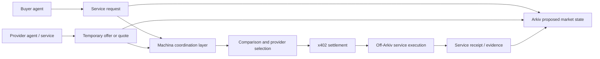

# Machina architecture

> **Status: conceptual.** This document describes a proposed architecture, not an implemented system or integration.

Machina is proposed as the coordination layer for machine-to-machine service commerce. It sits between discovering a service and settling for it, helping participants work with temporary market state and execution evidence.

## Participants and layers

- **Buyer agent** expresses a service need: capability, volume, budget, required SLA or accuracy, region, deadline, and expiry.
- **Provider agent or machine-accessible service** publishes temporary availability or offers, or returns a quote for a request.
- **Machina Market** is the coordination product: discovery, requests, RFQs, comparison, selection, and the link to execution evidence.
- **Arkiv market-state layer** is proposed for structured, time-scoped entities such as offers, requests, quotes, availability, and receipts.
- **x402 settlement** is proposed as the rail used when the buyer pays the selected provider.
- **Off-Arkiv execution boundary** holds the actual service call and sensitive or bulky data.



## Canonical lifecycle

The intended sequence is:

```text
Buyer Agent → Service Request → Machina Market → Temporary Provider Offers
→ RFQ / Quote → Comparison → Provider Selection → x402 Settlement
→ Service Execution → Service Receipt → Reputation / Market Evidence
```

An RFQ is a coordination step that may be appropriate when a buyer needs provider-specific terms. It does not make Machina a payment processor or executor.

## Responsibility boundaries

| Concern | Proposed responsibility |
| --- | --- |
| Discovery, request handling, RFQs, comparison, selection | Machina Market |
| Structured market state, expiration, provenance, receipt records | Arkiv |
| Payment when the buyer pays the selected provider | x402 |
| Credentials, private prompts, raw inputs and outputs, large files, sensitive payloads, service execution | Off Arkiv / provider and buyer systems |

The boundary is intentional: public coordination facts can be useful market state, while execution data may be private, sensitive, large, or latency-sensitive.

## Architecture implications

A future implementation should begin narrowly: model the core entities, validate expiration and query requirements, then build coordination flows around them. It should not assume that all data belongs in Arkiv, that x402 performs selection, or that a receipt proves every aspect of service quality. Evidence design, privacy requirements, and dispute handling require validation before implementation.
